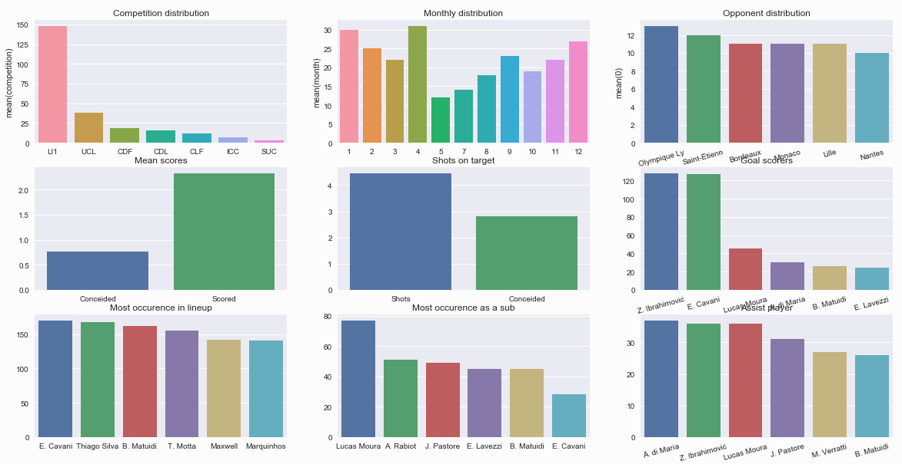
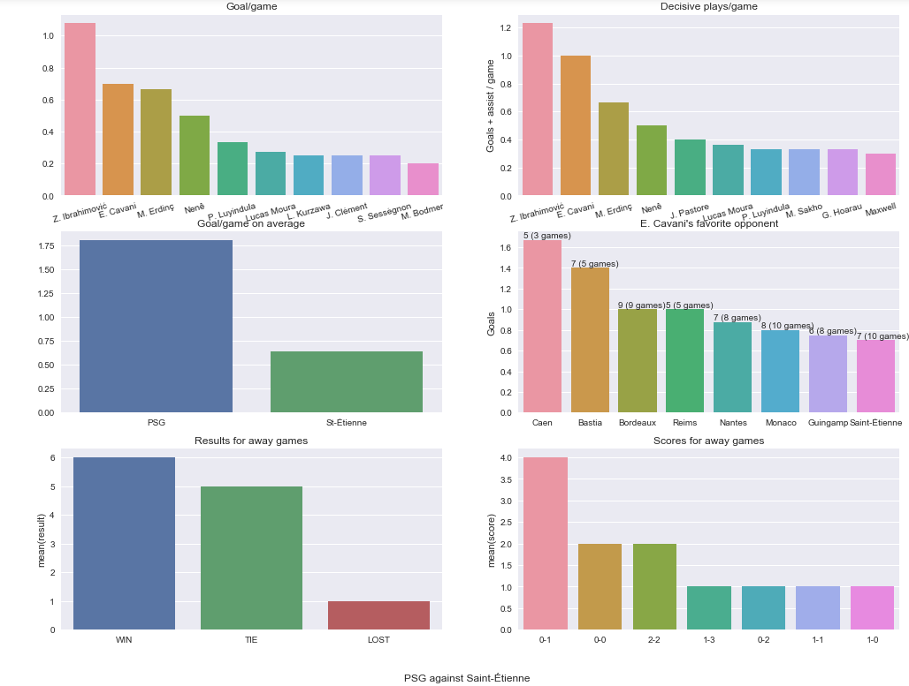

# Parsing and using Soccer data

## First Part - Parsing data

The first part aims to parse data from multiple websites : games, teams, players, etc.  
To collect data about a team and dump a json file (must have created a ``./teams`` folder) :
``python3 dumper.py team_name`` 

## Second Part - Data Analysis

The second part is to analyze the dataset to understand what I can do with it.

